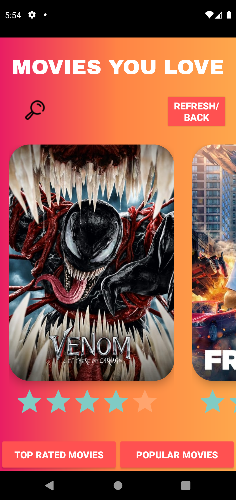
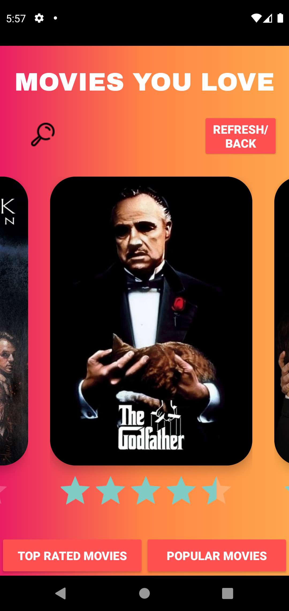
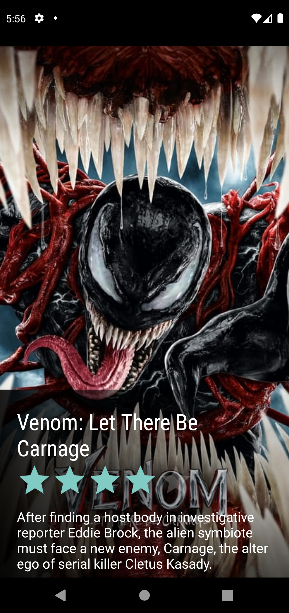
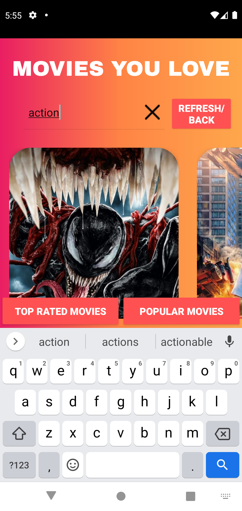
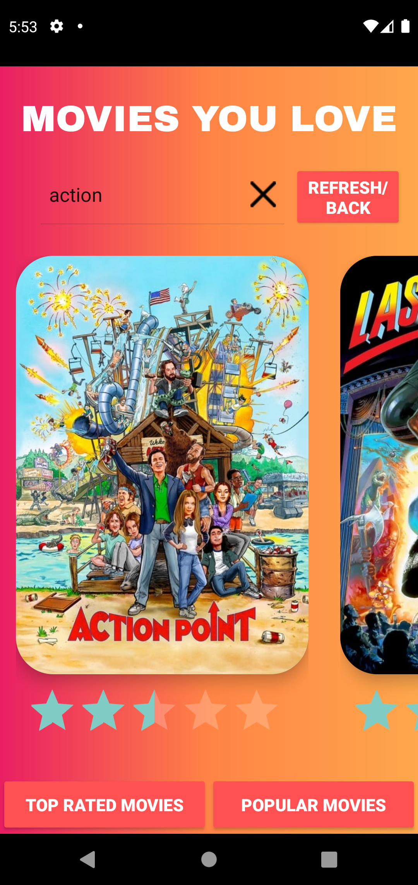
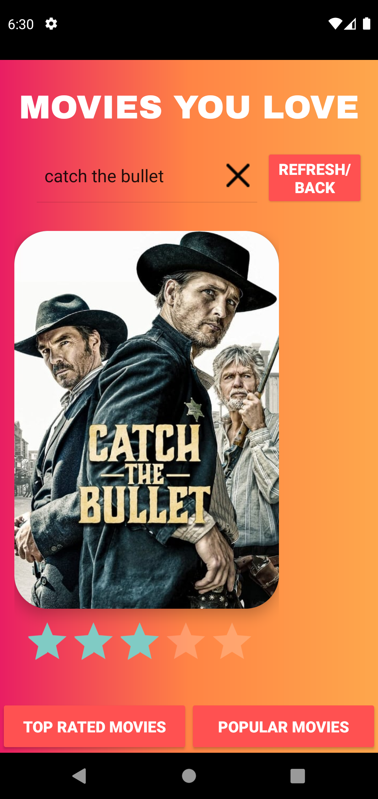

# PendoBrowser
An application that will allow users to browse through a selection of movies and TV shows. Using the TMDb (The Movie Database) API to fetch relevant information to display.

## Technologies and Components Used
- Navigation Search
- Async Task
- MVVM & Live-Data
- Glide 
- TMDB API
- POSTMAN API Platform
- Android Studio
- Hover Animation
- Proper usage of OOP principles
- Class separation by logical work
- Proper formation of folders and files

## What I learned
- Working with Android Studio-java afford to me modern tools and resources that helped me to build experience that I love,
- faster and easier, across every Android device.
- Also working with XML helped me to paint my app to life with nice UI ,Quickly ship features with flexible designs.
- At the beginning I face some difficulties with the MVVM Model design pattern architecture, but like always, I make it work!.

### Built with
- [TMDB API](https://developers.themoviedb.org/3/getting-started/introduction)
- [POSTMAN](https://www.postman.com)
- [Retrofit](https://square.github.io/retrofit/)
- [MVVM](https://www.tutorialspoint.com/mvvm/index.htm)
- [Stackverflow](https://stackoverflow.com/)

                
